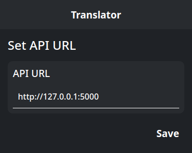
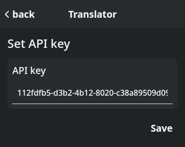
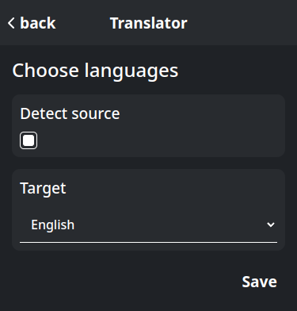

# Translator - Chrome Extension

## Overview

Translate selected text using LibreTranslate, a self-hosted translation service.


## Prerequisites
1. LibreTranslate: Up & Running. Follow setup steps from [LibreTranslate Github repository](https://github.com/LibreTranslate/LibreTranslate).

## Extension Setup

1. Clone this repository
```sh
git clone git@github.com:JBudny/translator.git
```
2. Install dependencies
```sh
yarn
```
3. Build extension
```
yarn build
```
4. Navigate to [chrome://extensions/](chrome://extensions/)
5. Enable "Developer mode" using the toggle switch in the top right corner.
6. Click the "Load unpacked" button in the top left corner.
7. Select the `.output/chrome-mv3` directory inside the `translator` directory.

## Extension configuration
| API URL  |   API Key   | Languages |
|----------|-------------|-----------|
|  |  |  |


## Technology Stack
- **CSS in JS**: [styled-components](https://styled-components.com/)
- **Error handling**: [react-error-boundary](https://github.com/bvaughn/react-error-boundary)
- **Form library**: [React Hook Form](https://react-hook-form.com/)
- **Frontend framework**: [React](https://react.dev/)
- **Icons**: [Font Awesome](https://fontawesome.com/)
- **JSON normalization**: [Normalizr](https://github.com/paularmstrong/normalizr)
- **Routing**: [React Router](https://reactrouter.com/)
- **Schema validation**: [Yup](https://github.com/jquense/yup)
- **Shadow DOM**: [React Shadow](https://github.com/Wildhoney/ReactShadow)
- **Static typing**: [TypeScript](https://www.typescriptlang.org/)
- **Web extension framework**: [WXT](https://wxt.dev/)

This project is licensed under the Apache License, Version 2.0 - see the [LICENSE](LICENSE) file for details.
